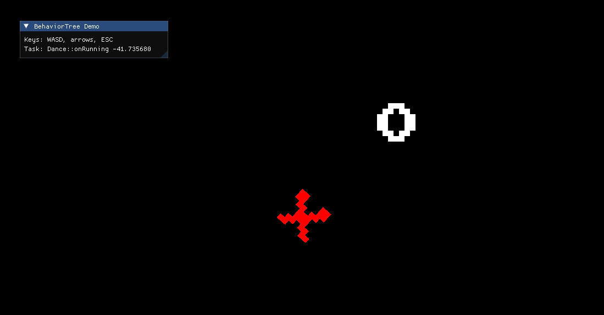
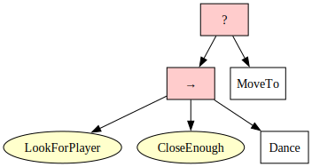

# Nothofagus + BehaviorTree Demo

This is a small demo project using the simple [Nothofagus](https://github.com/dantros/nothofagus) renderer and [BehaviorTree.CPP](https://www.behaviortree.dev/).



You, "the player", the white O character, can move using the arrow keys or the "gaming d-pad" WASD. The BehaviorTree controlled bot is the red X. Once it is close enough, it will start to dance for 2 seconds. If it is not close enough, it will move towards you.

The Behavior Tree implemented is:



The dot source file for this drawing is included in this repo [here](non_code/smart_follower_behavior_tree.dot), so you can adapt it to your own behavior trees. You will need https://graphviz.org/ to render it.

The goal of this small demo is:
- Provide a basic implementation for a "game engine"-like infrastructure using Nothofagus to render.
- Learn how to integrate BehaviorTree.CPP in your own C++ code base.
- Learn how to use BehaviorTree.CPP to implement simple behaviors in gaming applications.

Once you have cloned this repo, don't forget to download the dependencies with:
```
git submodule update --init --recursive
```
And then, you can build it using cmake and ninja or MSVC.

I hope it helps, enjoy!